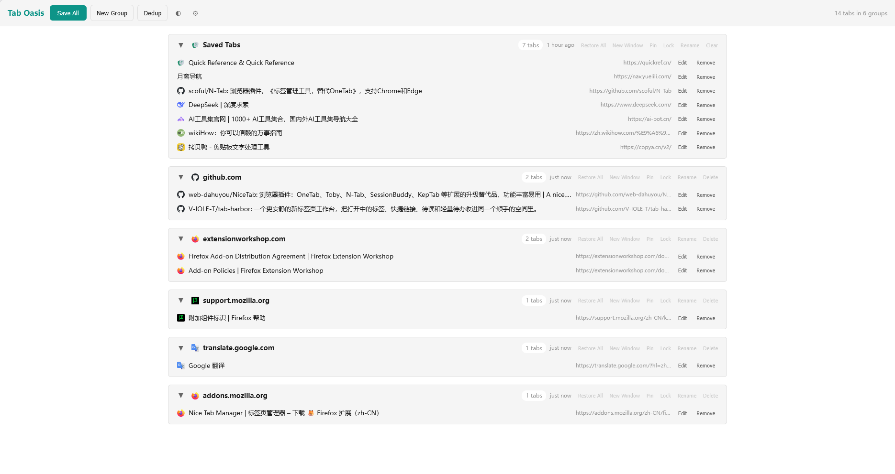
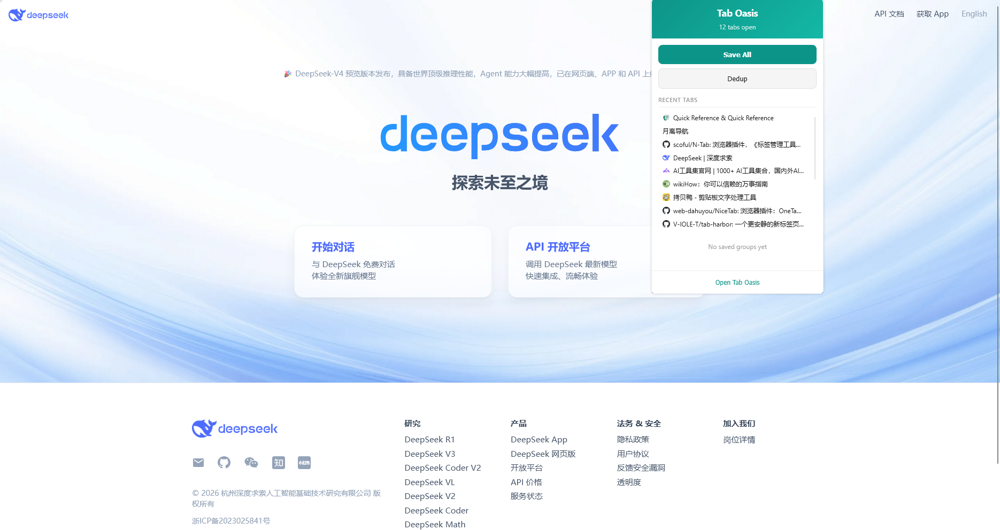

# Tab Oasis

A tab manager extension for Firefox.

Personal implement as Onetab alternatives, stay simple.

## Installation

Still waiting for online.

### Firefox (temporary)

1. Open `about:debugging#/runtime/this-firefox`
2. Click "Load Temporary Add-on"
3. Select the `manifest.json` file (or the `.zip` in `web-ext-artifacts/`)
4. Click the Tab Oasis icon in the toolbar to open the workbench

## Usage

### Features

- **Save All Tabs** (`Ctrl+Q`) — groups by domain, closes saved tabs
- **Save Current Tab** (`Alt+Q`)
- **Restore** tabs individually or entire groups at once
- **Restore to New Window**
- **New Group** — create empty groups manually
- **Drag & drop** tabs between groups, drag groups to merge
- **Pin / Lock / Rename / Delete** groups
- **Deduplicate** saved tabs by normalized URL
- **Recycle Bin** — 30-day auto-expiry, restore permanently deleted items
- **Cloud Sync** via GitHub/Gitee Gist (save token, push/pull)
- **Import/Export** JSON and HTML
- **Theme** — light / dark / system (click ☀️ button)
- **Right-click menu** — save individual tabs or all tabs
- Keyboard shortcuts: `Ctrl+Q` save all, `Alt+Q` save current
- English and Simplified Chinese (according to your browser)

### Cloud Sync Setup

1. Go to [GitHub Settings > Tokens](https://github.com/settings/tokens) or [Gitee](https://gitee.com/profile/personal_access_tokens)
2. Create a token with **gist** scope only
3. In Tab Oasis: Settings → paste token → Save Token → Push/Pull

## Project Structure

```
lib/          Shared modules (storage, IndexedDB, sync, tabs API)
background/   Background page — message routing, context menus, shortcuts
workbench.*   Main UI page
popup/        Toolbar popup
_locales/     i18n (en + zh_CN)
```

## Development

```bash
npm install
npx web-ext lint          # Validate
npx web-ext build         # Package as .zip
npx web-ext run           # Launch Firefox with extension loaded
```

## Preview

<p align="center">
  
  
</p>

## Data Storage

All data stored locally:

- IndexedDB for tab groups and `browser.storage.local` for preferences.
- Cloud sync is opt-in — you provide a GitHub/Gitee personal access token with `gist` scope.

## Contributing

This project **DOES NOT ACCEPT** Issues or Pull Requests.

If you would like to modify or extend this project, please fork the repository and make your own changes.

## License

[MPL 2.0](./LICENSE)

